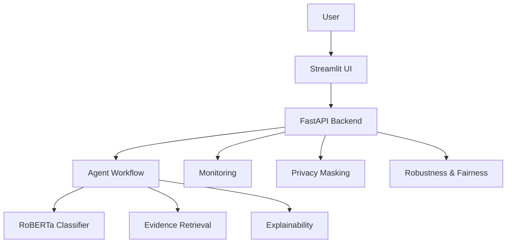

# Fake News & Misinformation Detection System

Production NLP system for fake news detection, evidence-backed analysis, monitoring, and responsible AI review.

## Project Overview

This repository delivers an end-to-end fake news and misinformation detection platform with a RoBERTa classifier, evidence retrieval, explainability, monitoring, privacy protection, robustness checks, fairness analysis, and a product-ready FastAPI + Streamlit interface.

## Features

- RoBERTa-based prediction with confidence scoring.
- Agentic workflow for retrieval, evidence analysis, decision making, and explanation.
- Real evidence retrieval with source-aware ranking.
- Structured explainability with trust score and token importance.
- FastAPI backend and Streamlit frontend.
- Monitoring for drift, confidence, and health degradation.
- Privacy masking for common PII before inference and logging.
- Robustness evaluation with adversarial perturbations.
- Bias analysis and Responsible AI documentation.

## Architecture



See the detailed diagrams in [docs/architecture](docs/architecture).

## Installation

```bash
python -m pip install -r requirements.txt
```

## Usage

### Local services

```bash
uvicorn src.api.main:app --host 0.0.0.0 --port 8000
streamlit run frontend/app.py --server.address 0.0.0.0 --server.port 8501
```

### One-command startup

```bash
docker compose up --build
```

## API Examples

### Health

```bash
curl http://localhost:8000/health
```

### Version

```bash
curl http://localhost:8000/version
```

### Predict

```bash
curl -X POST http://localhost:8000/predict -H "Content-Type: application/json" -d "{\"text\":\"article text\"}"
```

### Analyze

```bash
curl -X POST http://localhost:8000/analyze -H "Content-Type: application/json" -d "{\"text\":\"article text\"}"
```

## Monitoring

- Predictions are logged to `artifacts/monitoring/predictions.csv`.
- Drift summaries are saved to `artifacts/monitoring/drift_report.json`.
- Confidence summaries are saved to `artifacts/monitoring/confidence_report.json`.
- Health summaries are saved to `artifacts/monitoring/health_report.json`.

## Responsible AI

- [Privacy analysis](docs/privacy_analysis.md)
- [Robustness analysis](docs/robustness_analysis.md)
- [Ethics impact statement](docs/ethics_impact_statement.md)

## Screenshots

Presentation screenshots and UI captures are available in `docs/slides/images/`.

## Documentation

- [Final requirements matrix](docs/FINAL_REQUIREMENTS_MATRIX.md)
- [Deployment guide](docs/DEPLOYMENT_GUIDE.md)
- [Deployment verification](docs/DEPLOYMENT_VERIFICATION.md)
- [UAT report](docs/UAT_REPORT.md)
- [Final defense package](docs/FINAL_DEFENSE_PACKAGE.md)
- [Final project readiness](docs/FINAL_PROJECT_READINESS.md)
- [Agent sequence diagram](docs/AGENT_SEQUENCE_DIAGRAM.md)
