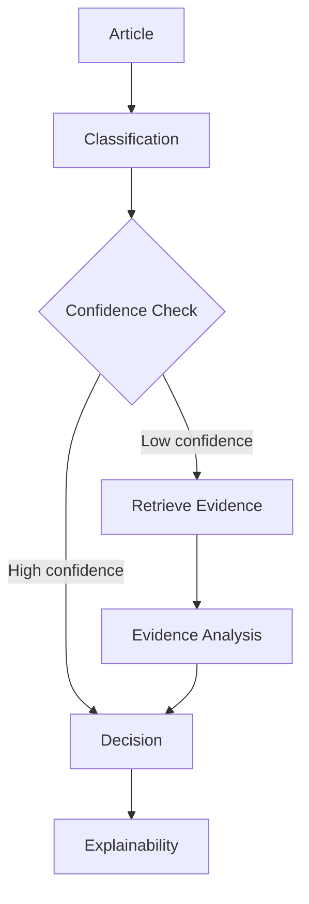

# Agent Workflow

```mermaid
flowchart TD
    A[Article] --> C[Classification]
    C --> Q{Confidence Check}
    Q -->|High confidence| D[Decision]
    Q -->|Low confidence| R[Retrieve Evidence]
    R --> E[Evidence Analysis]
    E --> D
    D --> X[Explainability]
```
