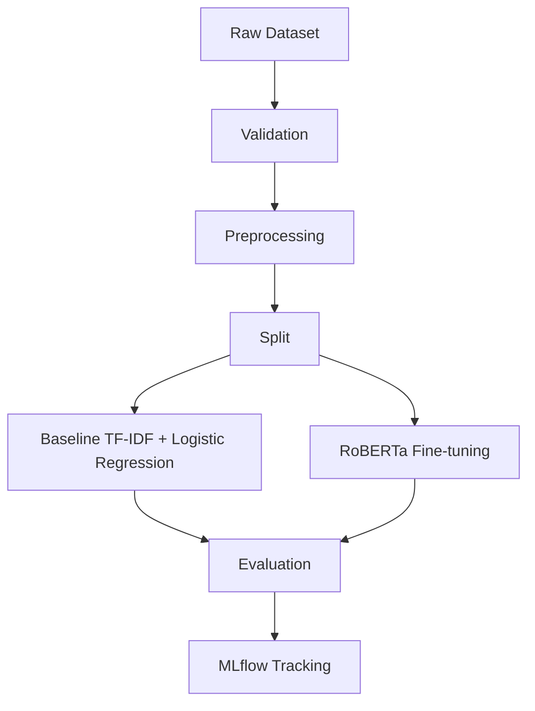

# Data Pipeline

```mermaid
flowchart TD
    R[Raw Dataset] --> V[Validation]
    V --> P[Preprocessing]
    P --> S[Split]
    S --> B[Baseline TF-IDF + Logistic Regression]
    S --> T[RoBERTa Fine-tuning]
    B --> E[Evaluation]
    T --> E
    E --> M[MLflow Tracking]
```
