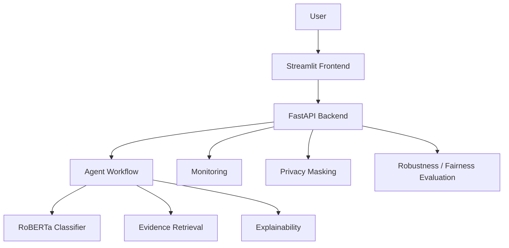

# Architecture Overview

The system is organized so the product layers remain isolated and testable.

```mermaid
flowchart TD
    U[User] --> UI[Streamlit Frontend]
    UI --> API[FastAPI Backend]
    API --> AG[Agent Workflow]
    AG --> CL[RoBERTa Classifier]
    AG --> RET[Evidence Retrieval]
    AG --> EXP[Explainability]
    API --> MON[Monitoring]
    API --> PRV[Privacy Masking]
    API --> RES[Robustness / Fairness Evaluation]
```
