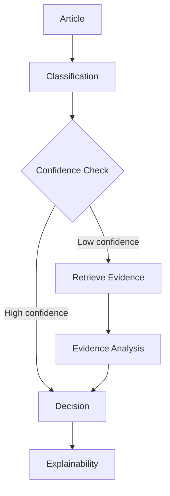

# Agentic AI Architecture

The agentic layer coordinates classification, confidence checking, evidence retrieval, evidence analysis, decision making, and explanation generation.

## Report Angle

- Emphasize modular reasoning.
- Explain why retrieval is only triggered when uncertainty is high.
- Describe how the final explanation integrates model, evidence, and trust signals.
