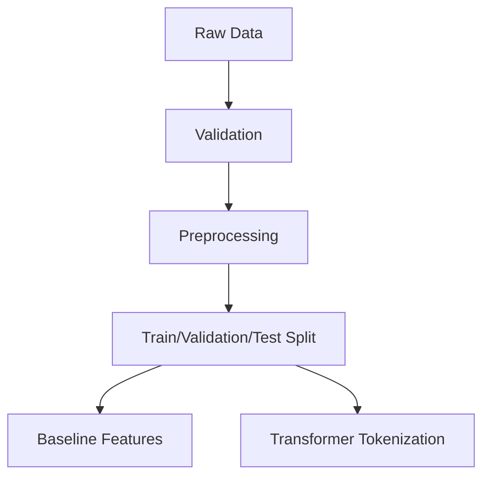

# Data Processing Pipeline

The data pipeline prepares raw text for both classical and transformer-based modeling. The processing stages are:

## Reporting Points

- Explain text normalization steps.
- Describe how label validation and split reproducibility are handled.
- Mention feature extraction for TF-IDF and tokenization for RoBERTa.
